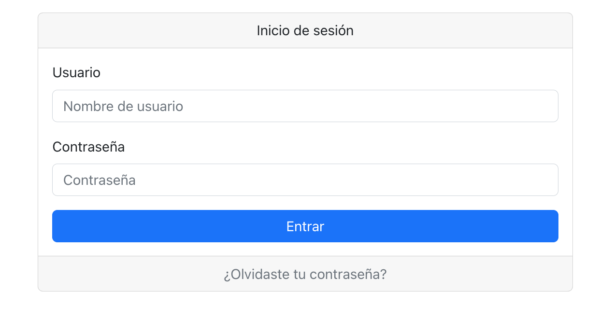
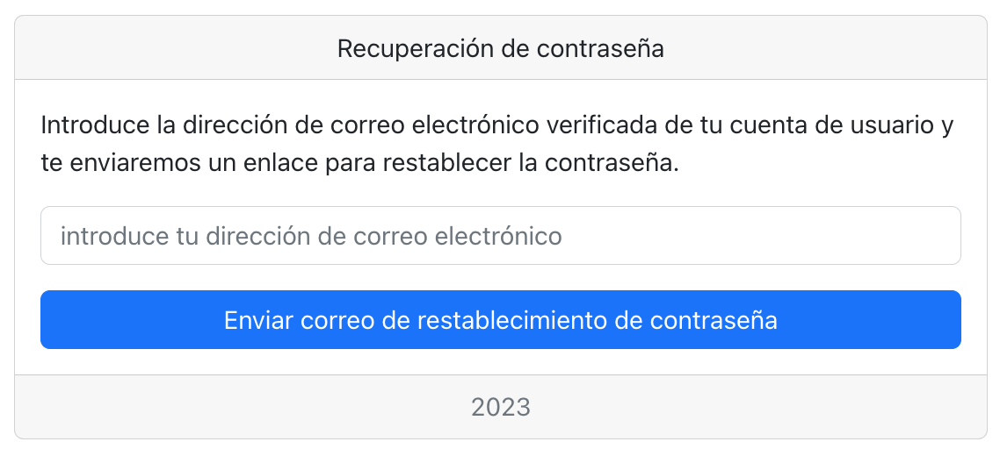
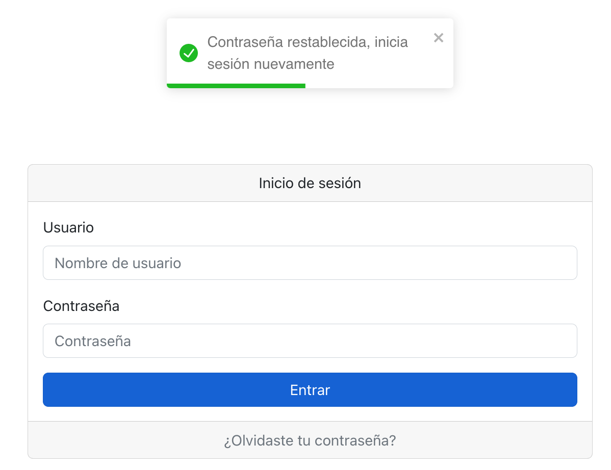
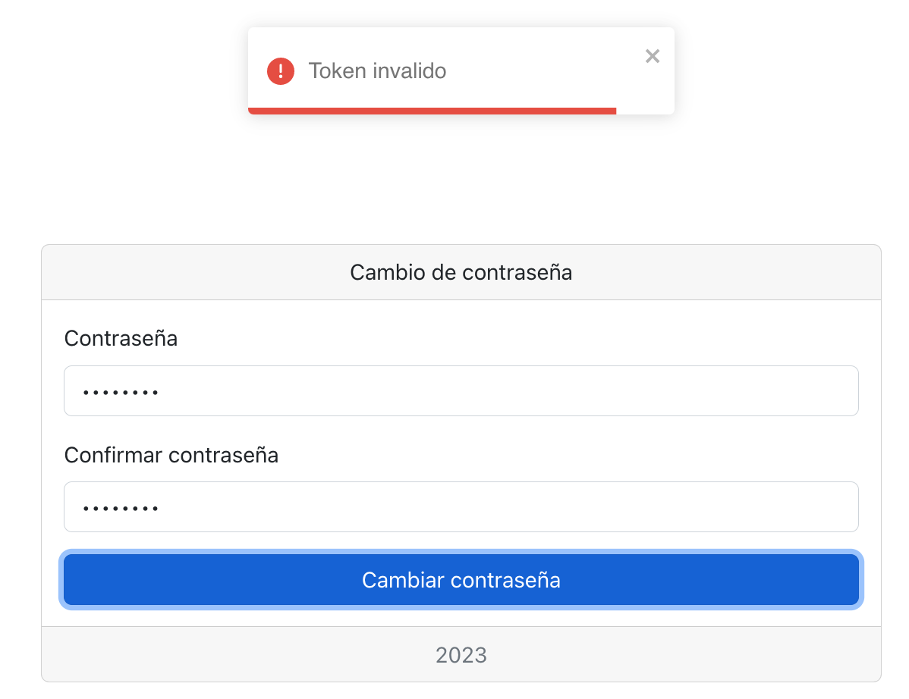
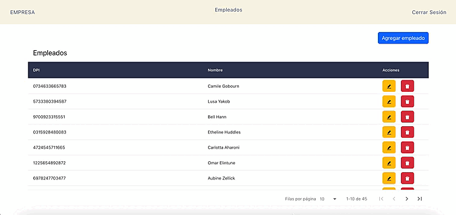
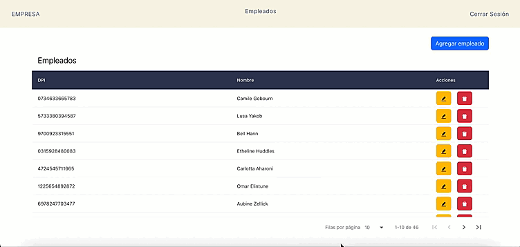
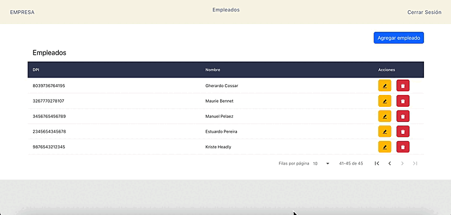
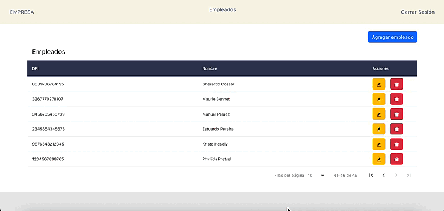
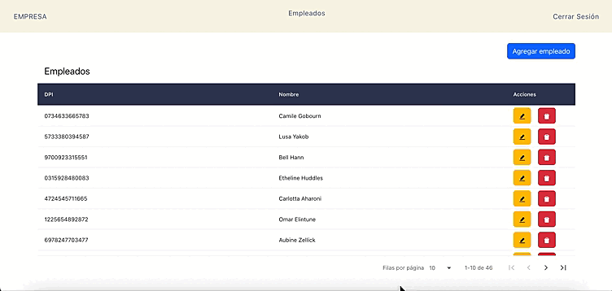

<h1 align="center">Empresa App</h1>

-   [Descripcion](#descripcion)
    -   [Componentes](#componentes)
-   [API](#api)
    -   [Enpoints](#enpoints)
        -   [Auth](#auth)
        -   [Employee](#employee)
        -   [Salary](#salary)
-   [Aplicacion web](#aplicacion-web)
    -   [Inicio de sesión](#inicio-de-sesión)
    -   [Recuperación de contraseña](#recuperación-de-contraseña)
    -   [Visualizacion de empleados y paginación](#visualizacion-de-empleados-y-paginación)
    -   [Detalles de un empleado](#detalles-de-un-empleado)
    -   [Nuevo empleado](#nuevo-empleado)
    -   [Modificar empleado](#modificar-empleado)
    -   [Eliminar empleado](#eliminar-empleado)

## Descripcion

Aplicación para la gestión de empleados

### Componentes

-   [API REST](empresa-api/) construida utilizando net core
-   [Aplicación web](empresa-sitioweb/) utilizando React

## API

Se incluye la documentación de todas las rutas de la api a través de Swagger. La documentación se encuentra disponible en `<IP>:<PORT>/swagger/index.html`

### Enpoints

#### Auth

`POST ​/api​/Auth​/login`

`POST ​/api​/Auth​/registrar`

`POST /api​/Auth​/recoveryPassword`

`POST ​/api​/Auth​/recoveryPassword​/change`

#### Employee

`GET /api​/Employee`

`POST ​/api​/Employee`

`PUT ​/api​/Employee`

`GET /api​/Employee​/{employeeId}`

`DELETE /api​/Employee​/{id}`

#### Salary

`GET /api​/Salary​/calculations​/{employeeId}`

## Aplicacion web

### Inicio de sesión

### Recuperación de contraseña

### Visualizacion de empleados y paginación

### Detalles de un empleado

### Nuevo empleado

### Modificar empleado

### Eliminar empleado

